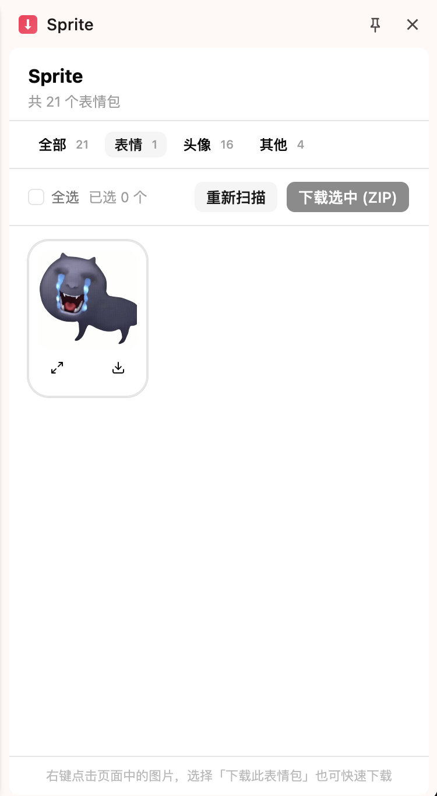
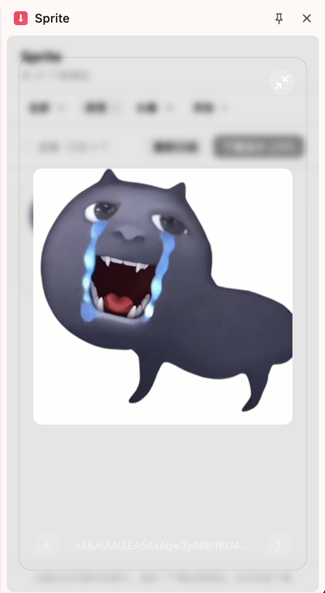

<h1 align="center">Sprite</h1>

<p align="center">A Chrome/Edge browser extension for downloading emojis and stickers from Douyin (TikTok China) web chat. Browse, preview, select, and batch-download emojis in a clean side panel interface.</p>

<p align="center">
  <a href="https://github.com/xingxingmofashu/sprite/releases"></a>
  <a href="https://github.com/xingxingmofashu/sprite/actions/workflows/ci.yml"></a>
  <a href="https://github.com/xingxingmofashu/sprite/blob/main/LICENSE"></a>
</p>

<p align="center">
  <a href="README.md">English</a> |
  <a href="README.zh.md">简体中文</a>
</p>

## Screenshots

<table>
  <tr>
    <td align="center"></td>
    <td align="center"></td>
  </tr>
  <tr>
    <td align="center">Side Panel</td>
    <td align="center">Preview Modal</td>
  </tr>
</table>

## Features

- **Side panel browse** — Click the extension icon to open a side panel showing all emojis and stickers from the current chat
- **Grid with preview** — Browse images in a responsive grid; click the magnify button to open a full-size preview with keyboard navigation
- **Batch ZIP download** — Select multiple emojis and download them as a ZIP archive
- **Single download** — One-click download for individual emojis from the card footer
- **Right-click context menu** — Right-click any emoji image on Douyin to download directly
- **i18n** — English and Simplified Chinese (中文)

## Installation

### From source

```sh
pnpm install
pnpm build
```

Then load the unpacked extension from `.output/chrome-mv3/`:
1. Open Chrome and go to `chrome://extensions`
2. Enable **Developer mode**
3. Click **Load unpacked** and select the `.output/chrome-mv3/` folder

### Development

```sh
pnpm dev        # Start dev server with hot reload
pnpm compile    # TypeScript type-check
```

## How it works

Sprite scans the DOM of an active Douyin chat page and extracts emoji/sticker image URLs from known CDN domains. Images are proxied through the background service worker (which has `host_permissions` to bypass CORS) and displayed as base64 data URLs in the side panel.

| Entrypoint | Purpose |
|---|---|
| `sidepanel/` | Main UI — React app with emoji grid, toolbar, and preview modal |
| `background.ts` | Service worker — context menu, image proxy, ZIP download |
| `content.ts` | Content script — DOM scanning on `*.douyin.com/*` |

## Tech Stack

- **WXT** v0.20 — Vite-based browser extension framework
- **React** 19 + TypeScript
- **Tailwind CSS** v4 + shadcn/ui (Card, Dialog, Empty, Button, Checkbox)
- **JSZip** — Client-side ZIP packaging
- **Lucide** — Icons

## License

MIT
